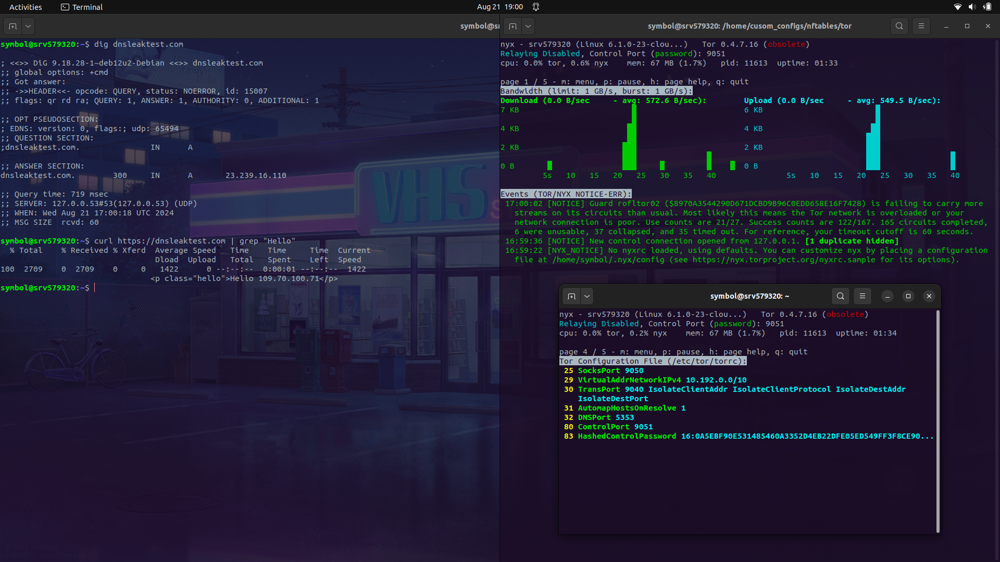
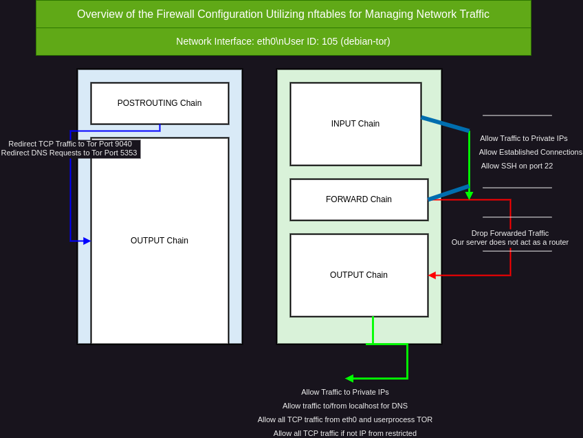

# TOR Configuration
This is a quick guide for forcing all outbound traffic from VPS over the tonetwork, aka nodes. Traffic will not be allowed to establish connection or send outbound requests wihout going trough tor-network. We enforece this using nftables firewall ruleset. Proiveed by offcial tor documentatoin.
- *Tor Documentation*: https://gitlab.torproject.org/legacy/trac/-/wikis/doc/TransparentProxy#local-redirection-through-tor 
- *Nftables Documentation:* https://wiki.nftables.org/wiki-nftables/index.php/Main_Page


## Features Firewall
-   Forces all outbound traffic through TOR network ✅
-   Allow traffic to the loopback interface ("lo"), Handles DNS queries through TOR ✅
-   Allow incomming SSH connections ✅
-   Accept established connecitons ✅
-   Allow traffic to private IP addresses range, internal communication ✅
    - ```
       set private {
                type ipv4_addr
                flags interval
                elements = { 10.0.0.0/8, 172.16.0.0/12, 192.168.0.0/16, 127.0.0.0/8 }
       }
      ``
- Allow outbound traffic generated by user UID of user running TOR process ✅
    - *DNS routed through '`lo` tor port `5353`*
    - *TCP traffic from private address ranges routed through tor port `9040`*
    - *chain OUTPUT*
-   Disabled fowarding on firewall ✅
    - *Traffic is dropped by default, because we have no need for the firewall to act as a router or gateway*
    - *chain FORWARD*
-   Reject all outbound traffic from unroutable ip rangeses ✅
    - ```
      set unrouteables {
                type ipv4_addr
                flags interval
                elements = { 127.0.0.0/8, 10.0.0.0/8, 172.16.0.0/12, 192.168.0.0/16, 0.0.0.0/8, 100.64.0.0/10, 169.254.0.0/16, 192.0.0.0/24, 192.0.2.0/24, 192.88.99.0/24, 198.18.0.0/15, 198.51.100.0/24, 203.0.113.0/24, 224.0.0.0/4, 240.0.0.0/4 }
      }
      ``


## Table of Contents

- [Features Firewall](#features-firewall)
0. [Assumptions Set-Up](#assumptions-set-up)
1. [Modifying TOR Configuration File](#modifying-tor-configuration-file)
2. [nftables](#nftables)
    - [Configuration File](#configuration-file-global_tor_routing.nft)
    - [Setting Up Unique Values](#setting-up-unique-values)
3. [Internal I.P on fresh interface](#internal-ip-on-fresh-interface)
4. [Interface Name](#interface-name)
5. [UID for Tor Process](#uid-for-tor-process)
 6. [Firewall Explained](#firewall-explained)




# Assumptions Set-Up
This guide assumes you have followed `configure_tor.md`, and confirmed TOR connection works.
This guide assumes you have followed `MullVad_DNS.md`, and confirmed DNS works


# Modifying TOR configuration file
We will be added a few rules that are needed for us to be able to route all traffic over 
TOR. These are very usefull especially when configuring with nftables firewall.

# `/etc/tor/torrc file` 🌱
```
SocksPort 9050
29 VirtualAddrNetworkIPv4 10.192.0.0/10
TransPort 9040 IsolateClientAddr IsolateClientProtocol IsolateDestAddr IsolateDestPort
AutomapHostsOnResolve 1
DNSPort 5353
ControlPort 9051
HashedControlPassword 16:16:01212Ff122122121DF3141E15EXAMPLHASHJ

```

## *Enabled Settings/Rules*

- **SocksPort 9050**
  - *Port TOR service is listening on for outbound connections to be routed.*

- **VirtualAddrNetworkIPv4 10.192.0.0/10**
  - *Specifies a range of virtual IPv4 addresses that Tor will use to map client addresses when routing traffic through the network. This is particularly useful for handling connections that don't use a direct IP address (e.g., resolving DNS).*

- **TransPort 9040 IsolateClientAddr IsolateClientProtocol IsolateDestAddr IsolateDestPort**
  - *Port TOR service is listening on for outbound transparent proxy connections, isolating streams based on client address, protocol, destination address, and destination port. This ensures greater privacy by making it more difficult to correlate traffic.*
  
- **AutomapHostsOnResolve 1**
  - *Automatically maps and resolves hostnames to an IP address within the virtual address network defined by `VirtualAddrNetworkIPv4`. This is useful for dealing with DNS requests in a privacy-preserving manner.*

- **DNSPort 5353**
  - *Port on which Tor will listen for DNS requests. When a DNS request is made, it will be routed through the Tor network, ensuring that DNS queries are anonymized.*

- **ControlPort 9051**
  - *Port for the Tor control protocol, which allows a user or application to communicate with the Tor process for status checks, configuration changes, or other administrative functions.*

- **HashedControlPassword 16:01212Ff122122121DF3141E15EXAMPLHASH**
  - *This hashed password is used to authenticate clients attempting to connect to the Tor control port. The password is hashed for security, ensuring that the actual password isn't exposed in the configuration file.*

## **You can just copy the above listed torrc file, the only thing needed to be modified is you're own Controll Port Password. (which you should already have set-up)**

 **Restart TOR**

   Apply the changes by restarting the TOR service:

   ```
   sudo systemctl restart tor
   ```

   When prompted, enter the password you configured. If everything is set up correctly, `nyx` will connect to the TOR controller and display the monitoring interface. Here you can verify the extra rules/lines you have enabled within /etc/tor/torrc are     displayed and working. 


# Nftables
Nftables is a very powerfull modern firewall, via cli. In this specific use-case we are going to configure the managing of traffic flow in a system that uses the Tor network for anonymity, forcing all outbound traffic trough TOR network aka nodes. We enforce strict controls on which traffic is allowed in and out of the system. The firewall setup involves two tables: nat for network address translation and filter for packet filtering.




## Coniguration File 'global_tor_routing.nft' 🌱
```nft 
# Verify your network interface with ip addr, verify interface by curling public I.P
define interface = eth0
# Verify tor uid with id -u tor, in debain find it using htop, for me it's: debian-tor. (will be user running tor prcess)
define uid = 105

# Private Internal I.P Utilised: 192.168.1.10


table ip nat {
        set unrouteables {
                type ipv4_addr
                flags interval
                elements = { 127.0.0.0/8, 10.0.0.0/8, 172.16.0.0/12, 192.168.0.0/16, 0.0.0.0/8, 100.64.0.0/10, 169.254.0.0/16, 192.0.0.0/24, 192.0.2.0/24, 192.88.99.0/24, 198.18.0.0/15, 198.51.100.0/24, 203.0.113.0/24, 224.0.0.0/4, 240.0.0.0/4 }
        }

        chain POSTROUTING {
                type nat hook postrouting priority 100; policy accept;
        }

        chain OUTPUT {
                type nat hook output priority -100; policy accept;
                # Accept range '10.192.0.0/10': (10.192.0.0 - 10.255.255.255)
                meta l4proto tcp ip daddr 10.192.0.0/10 redirect to :9040

                # Redirect DNS requests over TOR DNS Port.
                meta l4proto udp ip daddr 127.0.0.1 udp dport 53 redirect to :5353

                # We return beneath traffic to be processed by the next chain
                skuid $uid return
                oifname "lo" return
                ip daddr @unrouteables return

                # We redirect all our TCP traffic to port 9040
                meta l4proto tcp redirect to :9040
        }
}
table ip filter {
        set private {
                type ipv4_addr
                flags interval
                elements = { 10.0.0.0/8, 172.16.0.0/12, 192.168.0.0/16, 127.0.0.0/8 }
        }
        chain INPUT {
                type filter hook input priority 0; policy drop;
                # Allow Local SSH connections
                iifname $interface meta l4proto tcp tcp dport 22 ct state new accept

                # The usual, accept lo and established con
                ct state established accept
                iifname "lo" accept
                # Accept private range of IP addresses
                ip saddr @private accept
        }

        chain FORWARD {
                # Traffic is dropped by default, because we have no need for the firewall to act as a router or gateway.
                type filter hook forward priority 0; policy drop;
        }

        chain OUTPUT {
                type filter hook output priority 0; policy drop;

                # In this chain will only allow traffic generated by user UID of user running TOR process
                # And the traffic must be originating from the interface listed
                ct state established accept
                oifname $interface meta l4proto tcp skuid $uid ct state new accept

                # Allow traffic to the loopback interface ("lo"), Handles DNS queries through TOR
                oifname "lo" accept

                # Allow traffic to private IP addresses (internal communication)
                ip daddr @private accept
        }
}
```


# Setting Up Unique Values
Within the firewall configurations there are a few unique requirements necessary for the firewall to work outside of
just having TOR running with all the listening PORT working.

## Interfaces Needed 🌱
After having successfully set-up a internal i.p address you should have atleast 3 iterfaces up

``` 
eth0: flags=4163<UP,BROADCAST,RUNNING,MULTICAST>  mtu 1500
        inet 92.113.25.94  netmask 255.255.255.0  broadcast 92.113.25.255
        inet6 fe80::be24:11ff:fe5f:94cf  prefixlen 64  scopeid 0x20<link>
        inet6 2a02:4780:28:adb3::1  prefixlen 48  scopeid 0x0<global>
        ether bc:24:11:5f:94:cf  txqueuelen 1000  (Ethernet)
        RX packets 14349135  bytes 1572472373 (1.4 GiB)
        RX errors 0  dropped 1647  overruns 0  frame 0
        TX packets 119322  bytes 35839211 (34.1 MiB)
        TX errors 0  dropped 0 overruns 0  carrier 0  collisions 0

eth1: flags=4163<UP,BROADCAST,RUNNING,MULTICAST>  mtu 1500
        inet 192.168.1.10  netmask 255.255.255.0  broadcast 0.0.0.0
        inet6 fe80::d417:81ff:fed4:5c64  prefixlen 64  scopeid 0x20<link>
        ether d6:17:81:d4:5c:64  txqueuelen 1000  (Ethernet)
        RX packets 174643  bytes 7340004 (6.9 MiB)
        RX errors 0  dropped 0  overruns 0  frame 0
        TX packets 40  bytes 2572 (2.5 KiB)
        TX errors 0  dropped 0 overruns 0  carrier 0  collisions 0

lo: flags=73<UP,LOOPBACK,RUNNING>  mtu 65536
        inet 127.0.0.1  netmask 255.0.0.0
        inet6 ::1  prefixlen 128  scopeid 0x10<host>
        loop  txqueuelen 1000  (Local Loopback)
        RX packets 37161  bytes 18862281 (17.9 MiB)
        RX errors 0  dropped 0  overruns 0  frame 0
        TX packets 37161  bytes 18862281 (17.9 MiB)
        TX errors 0  dropped 0 overruns 0  carrier 0  collisions 0

```

# Internal I.P on fresh interface 
- (Virtual Network Interface Setup)

This guide provides instructions for creating a virtual network interface on both Debian/Ubuntu-based and Red Hat/CentOS-based systems. 
The internal I.P we are creating is `192.168.1.10` falls within the `192.168.0.0/16` range. 
- *The range of "192.168.0.0/16"* : `192.168.0.0` to `192.168.255.255`.

## 1. Create a Virtual Network Interface

On many modern Linux distributions, interfaces are typically managed by the system’s network manager or by configuration files. However, if you need to manually create a new virtual interface, you can use the following approach. This is usually more about configuring a virtual interface rather than creating one from scratch, as the creation of interfaces might depend on the VPS provider's setup.

In this setup, the internal IP on an internal interface acts as a bridge or gateway to manage traffic between different network segments. This internal interface can handle traffic between the local system and the Tor network, effectively isolating internal and external traffic flows.

`interface` 🌱
```
eth1: flags=4163<UP,BROADCAST,RUNNING,MULTICAST>  mtu 1500
        inet 192.168.1.10  netmask 255.255.255.0  broadcast 0.0.0.0
        inet6 fe80::d417:81ff:fed4:5c64  prefixlen 64  scopeid 0x20<link>
        ether d6:17:81:d4:5c:64  txqueuelen 1000  (Ethernet)
        RX packets 174643  bytes 7340004 (6.9 MiB)
        RX errors 0  dropped 0  overruns 0  frame 0
        TX packets 40  bytes 2572 (2.5 KiB)
        TX errors 0  dropped 0 overruns 0  carrier 0  collisions 0

```
(we can actually set the ip addres, pretty cool)


**Using `ip` command:**

If you’re creating a virtual interface (e.g., `eth1`), you can use the `ip` command to configure it. First step is to find you're parent interface for public I.P . Usually you can see it visually by just running 'ifconfig' . But we can confirm which one it is by curling dnsleaktest.com And matching to corresponding it to interface I.P listed in output ifconfig.


- Create interface 
```bash
sudo ip link add link <parent_interface_name> name eth1 type macvlan mode bridge
```

e.g;
```bash
sudo ip link add link eth0 name eth1 type macvlan mode bridge
```

Here’s what this does:
- `link eth0`: Specifies that `eth0` is the parent interface.
- `name eth1`: Creates a new virtual interface named `eth1`.
- `type macvlan mode bridge`: Configures it as a MACVLAN in bridge mode.

**Bring Up the Interface:**

```bash
sudo ip link set eth1 up
```

## 2. Assign an IP Address to the New Interface

Once you have the interface (e.g., `eth1`) set up, you can assign an IP address to it.

```bash
sudo ip addr add 192.168.1.10/24 dev eth1
```

**Bring Up the Interface:**

```bash
sudo ip link set dev eth1 up
```

## 3. Confirm the Interface is Up and Accessible

To verify that the interface is functioning correctly, you can ping the IP address assigned to it.

```bash
ping 192.168.1.10
```

Now to also cinfirm it's internal attempt to ping it from outside of VPS ssh connection


## Overview
Your `nftables` firewall configuration handles traffic as follows for the IP address `192.168.1.10`:


### Traffic to/from `192.168.1.10`
- **Allowed** under the `INPUT` and `OUTPUT` chains if it complies with the specified rules.

  **Rules:**
  - **`INPUT` Chain:**
    - Traffic from `192.168.1.10` is allowed if it is part of an established connection or if it originates from the `private` IP range. `192.168.1.10` falls within the `private` range (`192.168.0.0/16`), so it will be accepted if it meets these criteria.
  - **`OUTPUT` Chain:**
    - Traffic destined for `192.168.1.10` is allowed because it is within the `private` IP range. This includes both established connections and new connections if they are not explicitly blocked.

  **Non-compliance:**
  - Traffic from `192.168.1.10` that does not match the established connection state or the `private` IP range rules may be dropped.

### NAT Rules
- **Traffic to/from `192.168.1.10`** is subject to NAT rules.

  **Rules:**
  - **`OUTPUT` Chain (NAT Table):**
    - **TCP Traffic:** Traffic destined for IP ranges within `10.192.0.0/10` is redirected to port `9040`. While `192.168.1.10` is not within `10.192.0.0/10`, general TCP traffic from `192.168.1.10` will also be redirected to port `9040` by the default rule.
    - **UDP Traffic:** Traffic destined for `127.0.0.1` on UDP port `53` is redirected to port `5353`. Since `192.168.1.10` does not match this rule directly, it is not affected by this specific redirection.

  **Non-compliance:**
  - Traffic that does not meet the specific NAT redirection rules will be handled by default acceptance or rejection policies.

### Summary
- **Incoming and Outgoing Traffic:** Allowed if it matches the rules in the `INPUT` and `OUTPUT` chains. Specifically, traffic from and to `192.168.1.10` is permitted as it falls within the `private` IP range.
- **NAT:** Traffic to/from `192.168.1.10` will follow the general NAT redirection rules, including the default TCP redirection to port `9040`.


# Interface Name
The interface we have created, and called `eth1`, is the internal I.P of parent `eth0` . For you're case of creating internal-ip it might have been a different parant interface. The parent interface name should be set as a variable within the `.nft` file :

```
define interface = <parent_interface>
define uid = <uid_of_tor_user>
```

e.g;

```
🌱 define interface = eth0
🌱 define uid = 105

```
# UID for Tor Process

For the firewall to route traffic accordingly, we use the identifier, also known as the UID (User ID), of the user running the current Tor process.

**Purpose:**

- **Firewall Rules and Traffic Filtering:** Allows specific firewall rules to be applied only to traffic originating from the Tor process, based on its UID.
- **Privilege Separation:** Ensures the Tor process operates with the least necessary privileges, enhancing security by limiting the potential damage if compromised.
- **Isolation from Other Processes:** Helps isolate the Tor process from other system processes, preventing unauthorized access and potential security issues.
- **Accountability and Logging:** Facilitates monitoring and logging of activities specific to the Tor process.

**How to Find the UID:**

You can find the UID by running the `htop` command and looking for the user associated with the `tor` process:
- looking for the following path:
`/usr/bin/to`" within htop.

```
htop
```
```
🌱 19224    debian-tor 20 N/A  00:00:10   /usr/bin/tor --defaults-torrc /etc/tor/torrc
```

Then you will need to fetch the ID from the user you found:
```
id -u <username>
```

e.g;
```
🌱 id -u debian-tor
```

#### Traffic Based on UID in `INPUT` Chain
- **Allowed** under the `INPUT` chain if it complies with the specified rules related to UID.

  **Rules:**
  - **`INPUT` Chain:**
    - **Local Connections:** Traffic originating from processes owned by the user with the specified UID is evaluated according to the `INPUT` chain rules. For example, if the Tor process runs with UID `105` (`debian-tor`), any incoming traffic from this UID will be managed according to the rules.
    - **Local SSH Connections:** Connections initiated on the specified network interface `$interface` that are new TCP connections on port `22` (SSH) are allowed. This is useful for managing SSH access while ensuring that only established connections or those meeting the criteria are accepted.
    - **Established Connections:** Any traffic that is part of an established connection is allowed, regardless of the UID.
    - **Loopback Interface:** Traffic on the loopback interface (`lo`) is accepted.
    - **Private IP Range:** Traffic originating from IP addresses within the `private` IP range (e.g., `10.0.0.0/8`, `172.16.0.0/12`, `192.168.0.0/16`, `127.0.0.0/8`) is accepted.

  **Non-compliance:**
  - Traffic from processes not owned by the specified UID or those not meeting the established connection state, SSH, or `private` range criteria may be dropped.

#### Traffic Based on UID in `OUTPUT` Chain
- **Allowed** under the `OUTPUT` chain if it complies with the specified rules related to UID.

  **Rules:**
  - **`OUTPUT` Chain:**
    - **New Connections:** Outgoing TCP traffic from processes owned by the user with the specified UID is allowed if it matches the rules for new connections. For instance, traffic from UID `105` is permitted if it is a new TCP connection and follows the specified rules.
    - **Loopback Interface:** Traffic to the loopback interface (`lo`) is accepted.
    - **Private IP Range:** Traffic destined for IP addresses within the `private` IP range is allowed.
    - **NAT Redirections:** 
      - **TCP Traffic:** Traffic destined for IP ranges within `10.192.0.0/10` is redirected to port `9040`. While `192.168.1.10` is not within this range, TCP traffic from `192.168.1.10` will be redirected to port `9040` due to the general redirection rule.
      - **UDP Traffic:** Traffic destined for `127.0.0.1` on UDP port `53` is redirected to port `5353`. Since `192.168.1.10` does not match this rule, it is not affected by this specific redirection.

  **Non-compliance:**
  - Traffic from processes not owned by the specified UID, or traffic not matching the specified rules, may be dropped. For example, traffic that does not conform to the allowed states or specified UID rules will be rejected based on the chain policies.


# Firewall Explained

Welcome to the comprehensive guide for configuring and understanding your firewall setup using nftables. This document explains the purpose and structure of the provided nftables configuration file.

## Table of Contents

1. [Overview](#overview)
2. [Network Interface and User ID](#network-interface-and-user-id)
3. [NAT Table Configuration](#nat-table-configuration)
4. [Filter Table Configuration](#filter-table-configuration)
5. [Key Concepts](#key-concepts)

---

## Overview

This is a overview of the firewall configuration utilizing `nftables` for managing network traffic. The setup is designed to ensure secure and controlled access, with specific rules for handling traffic based on protocols, IP addresses, and user identities.

## Network Interface and User ID

1. **Network Interface**

   - **Definition**: `eth0`
   - **Purpose**: This is the primary network interface used for outbound and inbound traffic.

2. **User ID**

   - **Definition**: `105` (For `debian-tor`)
   - **Purpose**: The user ID under which the Tor process runs. Ensure to verify this ID on your system.

## NAT Table Configuration

The `nat` table handles network address translation. Here's a breakdown of its configuration:

### Set Definitions

- **Unrouteables**: Defines IP addresses and ranges that are considered non-routable or reserved for internal use. These addresses will not be forwarded outside the local network.

  ```nft
  set unrouteables {
      type ipv4_addr
      flags interval
      elements = { 127.0.0.0/8, 10.0.0.0/8, 172.16.0.0/12, 192.168.0.0/16, 0.0.0.0/8, 100.64.0.0/10, 169.254.0.0/16, 192.0.0.0/24, 192.0.2.0/24, 192.88.99.0/24, 198.18.0.0/15, 198.51.100.0/24, 203.0.113.0/24, 224.0.0.0/4, 240.0.0.0/4 }
  }
  ```

### Chains

- **POSTROUTING**: Handles NAT rules applied after routing decisions are made but before packets are sent out. This chain has a default policy of `accept`.

  ```nft
  chain POSTROUTING {
      type nat hook postrouting priority 100; policy accept;
  }
  ```

- **OUTPUT**: Handles NAT rules applied to packets generated by the local system. It includes:

  - Redirecting traffic destined for `10.192.0.0/10` to TOR port `9040`.
  - Redirecting DNS requests to TOR port `5353` on the local system.
  - Processing traffic based on user ID and loopback interface.
  - Redirecting all TCP traffic to TOR port `9040`.

  ```nft
  chain OUTPUT {
      type nat hook output priority -100; policy accept;
      meta l4proto tcp ip daddr 10.192.0.0/10 redirect to :9040
      meta l4proto udp ip daddr 127.0.0.1 udp dport 53 redirect to :5353
      skuid $uid return
      oifname "lo" return
      ip daddr @unrouteables return
      meta l4proto tcp redirect to :9040
  }
  ```

## Filter Table Configuration

The `filter` table is used to filter network traffic based on defined rules.

### Set Definitions

- **Private**: Defines IP addresses and ranges that are considered private or internal.

  ```nft
  set private {
      type ipv4_addr
      flags interval
      elements = { 10.0.0.0/8, 172.16.0.0/12, 192.168.0.0/16, 127.0.0.0/8 }
  }
  ```

### Chains

- **INPUT**: Handles incoming traffic. Rules include:

  - Allowing SSH connections on port `22` from the defined interface.
  - Accepting established connections and traffic on the loopback interface
  - Accepting traffic from private IP addresses.

  ```nft
  chain INPUT {
      type filter hook input priority 0; policy drop;
      iifname $interface meta l4proto tcp tcp dport 22 ct state new accept
      ct state established accept
      iifname "lo" accept
      ip saddr @private accept
  }
  ```

- **FORWARD**: Handles forwarded traffic. By default, all traffic is dropped since there is no need for routing.

  ```nft
  chain FORWARD {
      type filter hook forward priority 0; policy drop;
  }
  ```

- **OUTPUT**: Handles outgoing traffic. Rules include:

  - Accepting established connections and new connections from the specified interface and user ID.
  - Allowing traffic to the loopback interface
  - Alowing traffic to private defined internal IP addresses range.


  ```nft
  chain OUTPUT {
      type filter hook output priority 0; policy drop;
      ct state established accept
      oifname $interface meta l4proto tcp skuid $uid ct state new accept
      oifname "lo" accept
      ip daddr @private accept
  }
  ```

## Key Concepts

- **Network Interface**: The network device used for connecting to the network (e.g., `eth0`).
- **User ID (UID)**: The identifier for the user running a process (e.g., Tor).
- **NAT (Network Address Translation)**: Modifies network packet headers to route traffic appropriately.
- **Filtering**: Controls the traffic allowed to pass through based on rules defined in the `filter` table.

For further customization or troubleshooting, refer to the `nftables` documentation and adjust rules according to your specific network requirements.
For further customization or troubleshooting, refer to the `tor` documentation and adjust rules according to your specific network requirements.


