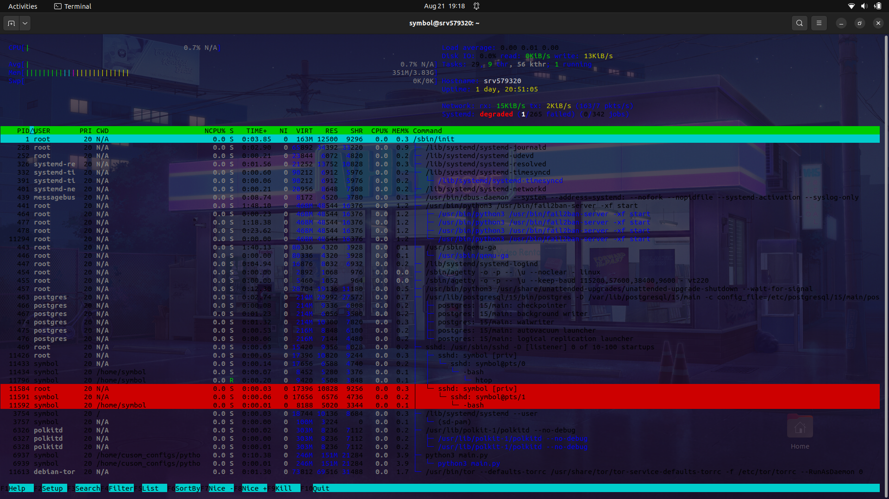

# htop Configuration

## Install
```
apt-get install htop
```



## Overview
`htop` is an interactive process viewer for Unix systems. It provides a dynamic, real-time view of the system's processes and resource usage. This document outlines the configuration settings used in a specific `htop` setup.

## Configuration File

The configuration file for `htop` is located at:
'/home/symbol/.config/htop'

### Configuration Details

Below is the configuration content with explanations for each setting:

```
# Beware! This file is rewritten by htop when settings are changed in the interface.
# The parser is also very primitive, and not human-friendly.
fields=0 48 17 125 52 2 49 18 38 39 40 46 47 1
sort_key=46
sort_direction=-1
tree_sort_key=0
tree_sort_direction=1
hide_kernel_threads=1
hide_userland_threads=0
shadow_other_users=0
show_thread_names=0
show_program_path=1
highlight_base_name=0
highlight_megabytes=1
highlight_threads=1
highlight_changes=1
highlight_changes_delay_secs=5
find_comm_in_cmdline=1
strip_exe_from_cmdline=1
show_merged_command=0
tree_view=1
tree_view_always_by_pid=1
header_margin=1
detailed_cpu_time=0
cpu_count_from_one=0
show_cpu_usage=1
show_cpu_frequency=0
show_cpu_temperature=1
degree_fahrenheit=0
update_process_names=1
account_guest_in_cpu_meter=0
color_scheme=3
enable_mouse=1
delay=15
left_meters=LeftCPUs2 RightCPUs2 Blank CPU Memory Swap
left_meter_modes=1 1 2 1 1 1
right_meters=LoadAverage DiskIO Tasks Blank Hostname Uptime Blank NetworkIO Systemd
right_meter_modes=2 2 2 2 2 2 2 2 2
hide_function_bar=0
```

## Explanation of Key Settings

- `fields`: Specifies which fields are displayed in the process list and their order.
- `sort_key`: Determines the field used for sorting processes.
- `sort_direction`: Defines the sorting direction (-1 for descending, 1 for ascending).
- `tree_sort_key` and `tree_sort_direction`: Control sorting within the tree view.
- `hide_kernel_threads`, `hide_userland_threads`: Toggle visibility of kernel and userland threads.
- `show_program_path`, `highlight_megabytes`, `highlight_threads`: Customizes the appearance and information shown for processes.
- `color_scheme`: Sets the color scheme for the interface.
- `enable_mouse`: Enables or disables mouse support in `htop`.
- `delay`: Determines the update interval in seconds.

For more details, consult the `htop` documentation or access the `htop` interface directly to modify settings.

